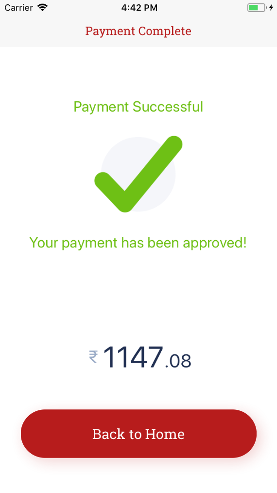

# Restaurant App

## Setup

### Installation

- run `npm install` or `yarn install`

### Run on Device

- run `yarn android` or `yarn ios` to run on device or emulator

### Start the web version

- run `yarn start:web`

### Project info

Main objective of this project was to have a single code base for both 
web and mobile apps with the logic and view separated.

#### ScreenShots - Native App

